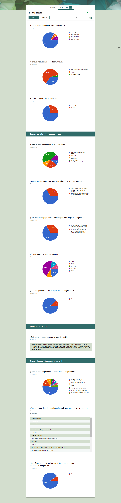
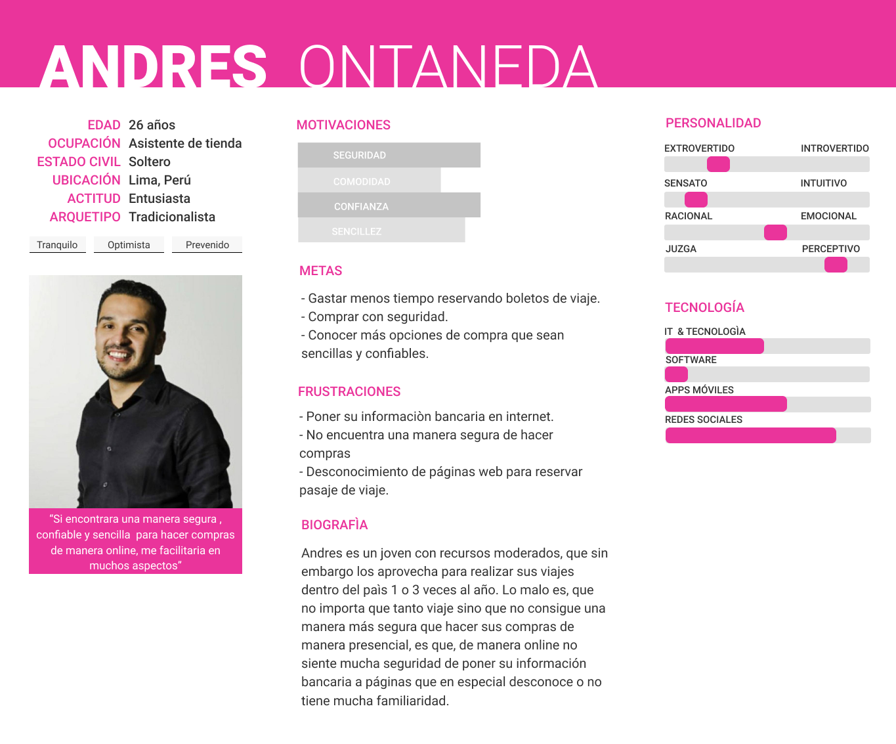

# Reto: redBus

## Desarrollado para:

[redBus](https://www.redbus.pe/?gclid=Cj0KCQjw1q3VBRCFARIsAPHJXrGzAVAAdvy-nKOu0Ycw_-7JY8ivaR8AD41k9GdZER_Kqdn-lQGeRaMaAjRVEALw_wcB)

## Equipo de Trabajo:

* Valeria. *(front-end developer)*
* Aurora. *(front-end developer)*
* Cervera Huamaní, Darcy. *(ux designer)*

## Objetivo del reto:

Maquetar y dar funcionalidad a una página responsiva de confirmación de la pasarela **Pago Efectivo** y **Banca online**.

## Requisitos del reto:

* ### Para el perfil front-end:

    * Debe mostrarse en **Inglés** y **Español**.
    * Mostrar las pestañas de **Banca por internet** y **Pagar en efectivo**.
    * En los íconos de **forma de pago** debe mostrar el texto correspondiente al banco seleccionado.
    * En la página web el enlace de **Encuentra tu punto de pago** debe mostrarse la dirección URL de Pago efectivo. [Ver página](https://ubicanos.pagoefectivo.pe/#/?tienda=[idServicio]&moneda=1&monto=100.00&ubicame=true&_k=nuha83)
    * En la página web el enlace *contacto@redbus.pe* debe abrir el cuadro de email por defecto del navegador (mailto).
    * El bloque **código de pago** debe permitir poner un número de 8 dígitos como máximo. Si la cantidad de dígitos aumenta, el tipo de fuente se debe ajustar para ocupar el espacio correspondiente al bloque que lo contiene.
    * El bloque **Total** debe permitir un monto con 4 dígitos, el texto debe ajustarse en tamaño al bloque contenedor si la cantidad de dígitos aumenta.
    * Para la vista de impresión de la página, debe verse al imprimir o hacer click en el enlace del ícono de impresora.

* ### Para el perfil ux designer:

    * Desarrollar una propuesta para vista de impresión de la página.

### Para el desarrollo del reto:

* Como ux designer seguir las etapas del DCU *(Diseño Centrado en el Usuario)* para presentar una propuesta de diseño de la vista de la pasarela de pago e impresión de la página.
* Como front-end developers la realización de la página de pasarela de pagos de  **Pago efectivo**.

# Etapas DCU (Diseño Centrado en el Usuario)

### A. Descubrimiento e Investigación.

Actividades:

1. Formulación de las preguntas para la entrevista con usuarios y encuesta online.

    1.1. Encuesta online. [Ver encuesta](https://docs.google.com/forms/d/e/1FAIpQLSdkAb4pjN-tFiSKlPWRDnOiD48SN_HWmi2sxaVfRP2aVTitew/viewform?usp=sf_link)

    1.2. Preguntas para la entrevista con usuarios. [Ver documento](https://docs.google.com/document/d/1UXy9qiQbRy-DGF_IcrX0-WtSGQSyRDqTr--_OCIeO5M/edit?usp=sharing)

2. Entrevista con usuarios.

3. Encuesta online a través de Google Forms.

* Recolección de datos de las respuestas dadas en la encuesta.

* Conslusion de la encuesta:

Según datos recolectados en la encuesta, el 72.4% de los usuarios prefieren realizar su compra de boleto de viaje de manera presencial, mientras que el 27.6% de los usuarios prefiere hacerlo de manera online.
Entonces, ¿Qué motivos influyen en la desición de los usuarios para optar comprar de manera presencial y no, de manera online?.
Bueno, el 52.4% indica que se siente más seguro/a de esta manera, y el indicador siguiente a esto es que el 14.3% tiene poca confianza de registrar sus datos.

De acuerdo a esto, se puede definir los siguientes **puntos de vista del usuario** para comprar por internet, que son:

* Seguridad y protección de datos bancarios.
* Una interfaz amigable, sencilla y fácil de entender.
* Realizar pagos mediante PagoEfectivo, para no poner su información bancaria.

### B. Síntesis y Definición.

Actividades:

1. Definir el problema:

* Se utilizó como herramienta el Diagrama de Afinidad.

    * Paso 1.- En post-its se colocó datos obtenidos en la encuesta y entrevista (como: cosas que le gustaria que tuviesen a la hora de comprar por internet, que problemas tuvieron al adquirir pasaje de bus)

    * Paso 2: Separar en grupos por temas.

    * Paso 3: Priorizar los temas que se obtuvieron desde el punto de vista del usuario que nos permitiran dar una propuesta para el diseño de la pasarela de pagos y diseño de la vista de impresión.

### C. Ideación.

1. Definición del user persona.

2. Definición de los Problems Statements.

3. Realización del Storyboard

### Presentación final.

# Herramientas utilizadas en el proyecto:

* Figma.
